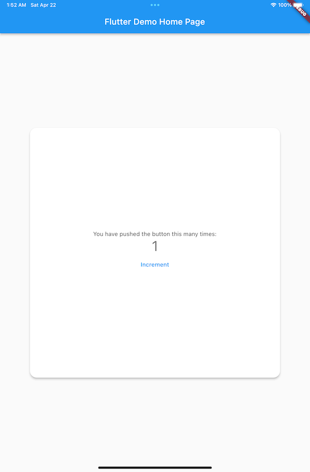

# flutter_adaptive_layout

A convenient way to implement screen-size-driven layouts for your widgets.

## Features

- extracts device's screen size
- applies provided (or overriden) breakpoints for the screen size
- renders a provided layout variant for the extracted screen size

## Gallery

| iPhone 14                         | iPad Mini                         | iPad Pro 12"                                |
|-----------------------------------|-----------------------------------|---------------------------------------------|
|  |  |  |

## Getting started

- install the library

```shell
flutter pub add flutter_adaptive_layout
```

- import the library

```dart
import 'package:flutter_adaptive_layout/flutter_adaptive_layout.dart';
```

- wrap your widget with an `AdaptiveLayout` builder

```dart
Widget build(BuildContext context) {
  return AdaptiveLayout(
    smallBuilder: (context, child) => child!,
    mediumBuilder: (context, child) =>
        Center(
          child: Material(
            color: Colors.white,
            elevation: 4,
            shape: RoundedRectangleBorder(
              borderRadius: BorderRadius.circular(16),
            ),
            child: ConstrainedBox(
              constraints: BoxConstraints.tight(const Size.square(400)),
              child: child,
            ),
          ),
        ),
    largeBuilder: (context, child) =>
        Center(
          child: Material(
            color: Colors.white,
            elevation: 4,
            shape: RoundedRectangleBorder(
              borderRadius: BorderRadius.circular(16),
            ),
            child: ConstrainedBox(
              constraints: BoxConstraints.tight(const Size.square(600)),
              child: child,
            ),
          ),
        ),
    child: const MyHomePage(),
  );
}
```

## Usage

Working example can be found in [/example](https://github.com/nerdy-pro/flutter-adaptive-layout/tree/main/example)
directory

Default breakpoints are set to `400` for small-medium screens and `600` for medium-large screens.
You optionally can change these by providing `smallBreakpoint` and `mediumBreakpoint` variables in `BreakpointQualifier`
for an `AdaptiveLayout`

```dart
Widget build(BuildContext context) {
  return AdaptiveLayout(
    qualifier: BreakpointsQualifier(
      smallBreakpoint: 300,
      mediumBreakpoint: 700,
    ),
    smallBuilder: ...,
    mediumBuilder: ...,
    largeBuilder: ...,
    child: ...,
  );
}
```

Or instead you also can implement your own `ScreenSizeQualifier`.

Also you can override the default breakpoints by wrapping your widget tree with an `BreakpointsSetting` instance:

```dart
Widget build(BuildContext context) {
  return BreakpointsSetting(
    smallScreenBreakpoint: 200,
    mediumScreenBreakpoint: 500,
    child: MaterialApp(...),
  );
}
```